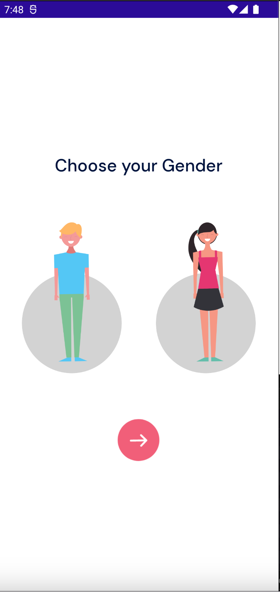
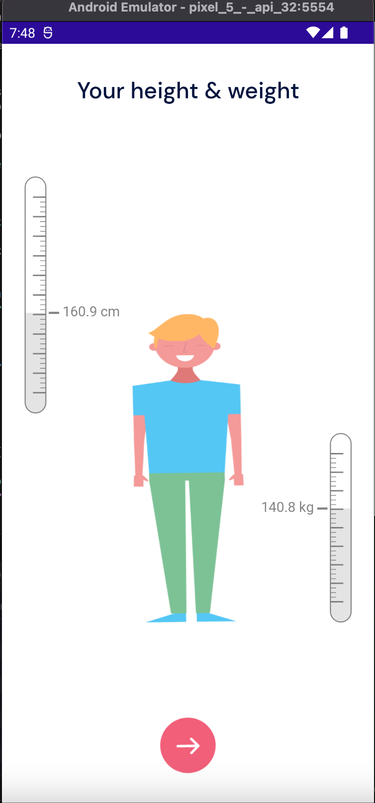
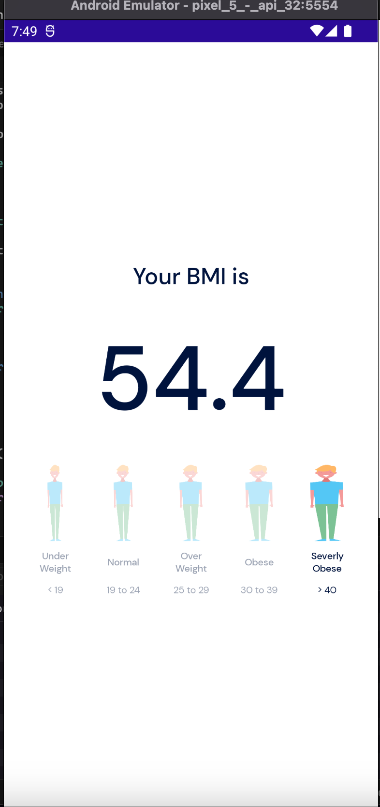
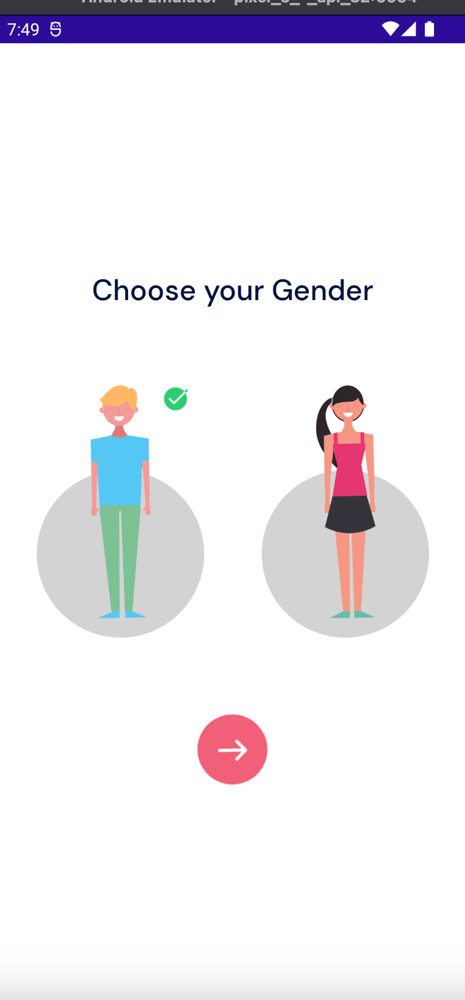

# BMI App

# BMI APP
----
### Team Members: 
anil
anudeep
Rahul

----
### Teammate's Contribution:  

#### Anil
 
  
  ##### Final_Project:
Backend Logic( cs files)
About UI changes
written the Documentation
creating the bmi calculator app design and history page.

  
#### Anudeep
 

  ##### Final_Project:
Frontend Logic for app
API connection
backend logic( creation and update)

#### Rahul

  ##### Final_Project:
layout for display form
services addition and module separation
UI changes in colors and style in resources
bmi logic in cs files(test bmi formula)

----
### Images:  
 
 

  #### Final_Project: 

